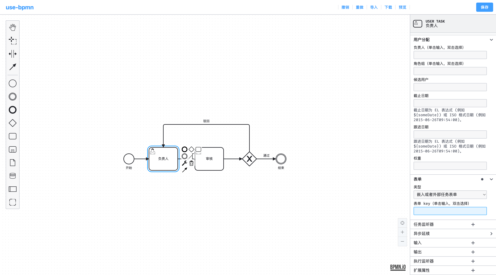

# use-bpmn

## 说明

- 本项目是基于 [bpmn.js](https://github.com/bpmn-io) 和 [nuxt](https://nuxt.com/) 开发演示
- 涵盖编辑器、属性面板及汉化等
- 覆盖的场景：
  - [x] 读取属性面板数据
  - [x] 更新属性面板数据
  - [x] 属性面板添加自定义事件
  - [ ] 属性面板添加属性
  - [ ] 自定义属性面板

## 命令

```bash
pnpm install

pnpm dev

pnpm generate
```

## 访问

Github Pages 预览：[wwlight.github.io/use-bpmn](https://wwlight.github.io/use-bpmn/)
| 访问地址 | 部署 | 状态 |
| :-----: | :-----: | :-----: |
| [use-bpmn.netlify.app](https://use-bpmn.netlify.app/) | [](https://app.netlify.com/start/deploy?repository=https://github.com/wwlight/use-bpmn) | [](https://app.netlify.com/projects/wwlight-use-bpmn/deploys) |
| [use-bpmn.vercel.app](https://use-bpmn.vercel.app/) | [](https://vercel.com/new/clone?repository-url=https://github.com/wwlight/use-bpmn) | - |

## 效果


